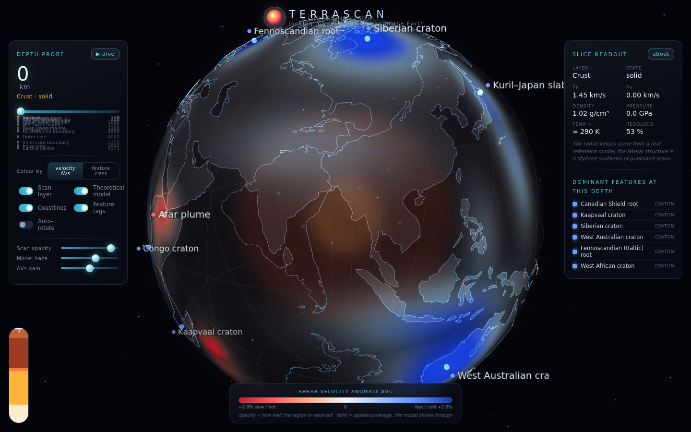

# TERRASCAN — *looking inward*

An interactive globe that turns the planet inside-out. Instead of borders and
terrain, it renders a **third kind of map**: what we actually *know* about the
Earth's interior, layered on top of what theory *predicts*, slice by slice with
depth — from the crust to the inner core.



| 660 km — cold slabs ring the Pacific | core–mantle boundary — the African LLSVP |
|---|---|
|  |  |
| inner core — where the scan goes blind, the model fills in | the theoretical model alone — a blurry estimate |
|  |  |

Two layers are composited in 3-D, sharing one camera:

| layer | what it is | how it looks |
|---|---|---|
| **The scan** | A classified slice of seismic tomography at the chosen depth — fast (cold, sinking) vs slow (hot, rising) shear-velocity anomalies. | **Crisp.** Colour encodes the anomaly (or the feature class); **opacity encodes how well the region is resolved.** Where coverage is thin, the scan fades and the model behind shows through. |
| **The model** | The smooth, radially-symmetric theoretical reference Earth (PREM). | **Blurry** — rendered to an offscreen buffer and Gaussian-blurred: an *estimation*, not an observation. Where the scan goes blind (the deep core), the estimate brightens to take over. |

It is deliberately **not** binary "scanned / not-scanned." The classification is
normalised to a diverging colour scale with transparency, so the map reads as a
continuous field of confidence and feature type.

## Run it locally

ES modules + `fetch` need to be served over HTTP (not opened as `file://`):

```bash
python3 -m http.server 8123
# then open http://127.0.0.1:8123/
```

Everything is **self-contained** — three.js is vendored under `vendor/`, the
geographic data under `data/`. No network calls at runtime.

## Controls

- **drag** orbit · **scroll** zoom
- **depth slider / ticks** dive to any depth or jump to a boundary (Moho, 410, 660, D″, CMB, ICB…)
- **▶ dive** auto-descend to the core · **↑/↓** nudge depth · **space** dive
- **Colour by** ΔVs (velocity) or feature class
- toggles for the scan layer, the theoretical model, coastlines, feature tags, auto-rotate
- sliders for scan opacity, model haze (blur), and ΔVs gain

## An honest note on the data

The **radial profile** — velocities, density, pressure, layer boundaries — is the
real [PREM](https://ds.iris.edu/spud/earthmodel) reference model (Dziewonski &
Anderson, 1981). The **lateral anomalies** are a hand-built, geographically-faithful
*synthesis* of well-established features from published global tomography
(the African & Pacific LLSVPs, subducted slabs, plume conduits, cratonic roots —
cf. S40RTS, SEMUCB-WM1, GyPSuM), not a pixel-exact re-render of any single dataset.
Treat it as an illustrative map of *what we know is down there*, not a measurement.

## Deploy to GitHub Pages

The site is plain static files at the repo root and uses only **relative** paths,
so it works under a project subpath (`user.github.io/repo/`):

1. Push this repo to GitHub.
2. **Settings → Pages → Build and deployment → Deploy from a branch**, pick
   `main` / `/ (root)`.
3. Open the published URL. (`.nojekyll` is included so all files are served verbatim.)

## How it's built

```
index.html            markup + import map
css/style.css         the HUD
js/earthModel.js      PREM radial model, layers, depth↔radius helpers
js/tomography.js      feature dataset → per-depth ΔVs + coverage DataTexture
js/geo.js             coastlines, land-mask rasteriser, lat/lon → 3D
js/shells.js          theoretical onion shells + the scan-slice shaders
js/postfx.js          render-to-target, separable blur, starfield, composite
js/ui.js              all DOM controls & readouts
js/main.js            scene, OrbitControls, depth logic, the render loop
vendor/               three.js + OrbitControls (pinned r160)
data/                 Natural Earth coastlines & land (preprocessed by build-geo.mjs)
```

Dev helpers (not needed at runtime): `build-geo.mjs` regenerates the compact geo
JSON; `shoot.mjs` renders verification screenshots with Playwright.

## Credits

- Coastlines & land polygons: **Natural Earth** (public domain).
- Reference model: **PREM** / IRIS.
- Rendering: **three.js**.
